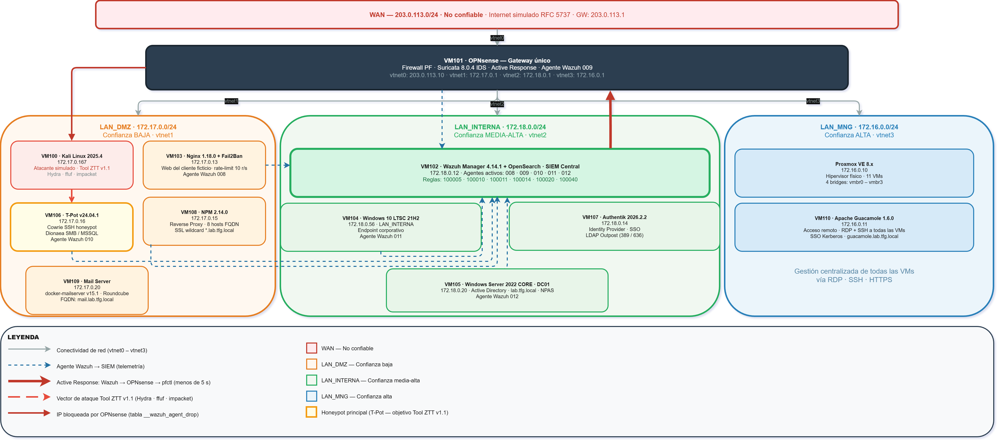

<div align="center">

# SOC Zero Trust
### Implementación de un SOC con Detección y Respuesta Activa Open Source

*Detección distribuida · Respuesta activa automatizada · Honeypots · Zero Trust aplicado*

*Coste en licencias de software: **0 €** · Funcionalidades equivalentes de mercado: **>35.000 €/año***

---

[](LICENSE)
[](src/ztt_framework.py)
[](config/wazuh/)
[](config/opnsense/)
[](config/)
[](src/)
[](#)

</div>

---

<div align="center">

[](#instalación-del-laboratorio)
[](#arquitectura)
[](#infraestructura)
[](#fases-de-la-tool-ztt-v11)
[](#resultados-de-validación)
[](#demo-tool-ztt-v11)
[](docs/)
[](config/)

</div>

---

## ¿Qué es este proyecto?

Este repositorio contiene la implementación completa de un **Security Operations Center (SOC) Zero Trust** construido íntegramente con herramientas open source sobre infraestructura virtualizada de bajo coste. El sistema opera sobre un único servidor físico con **11 máquinas virtuales** distribuidas en cuatro redes segmentadas.

El núcleo del proyecto es la **Tool ZTT v1.1** (*Zero Trust Tribunal*), una herramienta Python de desarrollo propio que recorre 9 fases de ataque progresivo sobre el laboratorio y verifica en tiempo real la respuesta del sistema —detección, bloqueo y alerta— ante cada vector de amenaza.

El sistema replica los principios del **NIST SP 800-207** (*Zero Trust Architecture*) y da cobertura funcional a los requisitos técnicos de la **Directiva NIS2** y el **ENS categoría BÁSICA**, con un gasto en licencias de software de **0 €**.

---

## Demo — Tool ZTT v1.1

> Ejecución completa en modo `--espectaculo`: 9 fases de ataque, detección distribuida y respuesta activa automatizada en tiempo real.

<div align="center">


*La herramienta activa Cowrie, Dionaea, Fail2Ban, Suricata y el Active Response de Wazuh→OPNsense en una secuencia reproducible de principio a fin.*

</div>

```bash
# Ejecutar demo completa para tribunal (con pausas explicativas)
sudo python3 src/ztt_framework.py --tribunal

# Modo espectáculo sin pausas (para grabación)
sudo python3 src/ztt_framework.py --espectaculo

# Verificar estado previo a la demo
sudo python3 src/ztt_framework.py --status

# Ejecutar una fase concreta
sudo python3 src/ztt_framework.py --fase 8
```

---

## Arquitectura

<div align="center">



</div>

La arquitectura segmenta la red en **cuatro zonas de distinto nivel de confianza**:

| Red | Segmento | Nivel de confianza | Hosts |
|-----|----------|--------------------|-------|
| WAN | 203.0.113.0/24 | No confiable | Internet simulado (RFC 5737) |
| LAN_DMZ | 172.17.0.0/24 | Baja | Atacante · Honeypots · Proxy · Mail |
| LAN_INTERNA | 172.18.0.0/24 | Media-Alta | SIEM · AD · IdP · Endpoints |
| LAN_MNG | 172.16.0.0/24 | Alta | Proxmox · Acceso remoto |

OPNsense actúa como gateway único entre todas las redes, con Suricata 8.0.4 en modo IDS sobre la interfaz WAN y PF como backend de bloqueo para el Active Response de Wazuh.

---

## Infraestructura

| VM | IP | Rol | Tecnología | Agente Wazuh |
|----|----|-----|------------|--------------|
| VM100 | 172.17.0.167 | Atacante simulado | Kali 2025.4 · Tool ZTT v1.1 · Python 3.13 | — |
| VM101 | 172.18.0.1 | Firewall perimetral | OPNsense · PF · Suricata 8.0.4 · AR | 009 |
| VM102 | 172.18.0.12 | SIEM central | Wazuh Manager 4.14.1 · OpenSearch | — |
| VM103 | 172.17.0.13 | Web honeypot + IDS host | Nginx 1.18.0 · Fail2Ban 0.11.1 · Ubuntu 20.04 | 008 |
| VM104 | 172.18.0.56 | Endpoint Windows | Win10 LTSC 21H2 · Active | 011 |
| VM105 | 172.18.0.20 | Active Directory | WinServer 2022 CORE · DC01 lab.tfg.local | 012 |
| VM106 | 172.17.0.16 | Honeypot avanzado | T-Pot v24.04.1 · Cowrie · Dionaea · ELK | 010 |
| VM107 | 172.18.0.14 | Identity Provider | Authentik 2026.2.2 · LDAP Outpost · SSO | — |
| VM108 | 172.17.0.15 | Reverse proxy | NPM 2.14.0 · SSL wildcard *.lab.tfg.local | — |
| VM109 | 172.17.0.20 | Mail server | docker-mailserver v15.1.0 · Roundcube | — |
| VM110 | 172.16.0.11 | Acceso remoto | Apache Guacamole 1.6.0 · RDP+SSH | — |

---

## Fases de la Tool ZTT v1.1

| Fase | Vector de ataque | IP origen | Herramienta | Alerta Wazuh | Respuesta |
|------|-----------------|-----------|-------------|--------------|-----------|
| 0 | Check status (3/3 ONLINE) | 172.17.0.167 | ping | — | — |
| 1 | Reconocimiento de puertos | 172.17.0.167 | RustScan 2.3.0 | — | — |
| 2 | Enumeración web | 172.17.0.167 | ffuf v2.1.0-dev | **100014** lvl 10 | — |
| 3 | Honeypot SSH éxito | 172.17.0.167 | Hydra v9.6 + ssh | **100011** lvl 14 | AR → PF block |
| 4 | Honeypot SSH fallo × 3 | 172.17.0.200* | ssh -b (alias) | **100040** lvl 15 | AR → PF block |
| 5 | Rollback PF | — | rollback-demo.sh | — | — |
| 6 | Fail2Ban doble capa | 172.17.0.200* | ssh -b (alias) | **100040** lvl 15 | iptables + PF |
| 7 | Rollback completo | — | fail2ban-client | — | — |
| 8 | Dionaea SMB + MSSQL | 172.17.0.167 | impacket | **100020** × 2 | — |

*\* IP alias del pool 172.17.0.200-209 creada en tiempo de ejecución sobre eth0 de VM100.*

### Flujo de Active Response

```
Cowrie (T-Pot VM106)
      │
      ▼
Wazuh Agente 010  ──►  Wazuh Manager (VM102)
                               │
                    regla 100011 / 100040 (lvl ≥ 14)
                               │
                    AR: opnsense-fw ──►  Agente 009 (VM101)
                                               │
                                         pfctl tabla
                                    __wazuh_agent_drop
                                               │
                                    IP atacante BLOQUEADA
                                    (latencia < 5 segundos)
```

---

## Resultados de validación

Validación ejecutada el **16 de mayo de 2026** con `--tribunal`, 5 agentes activos (008-012):

| Métrica | Valor |
|---------|-------|
| Verdaderos Positivos (TP) | **~29** |
| Falsos Positivos (FP) | **0** |
| Falsos Negativos (FN) | **1** *(regla 100005 — ffuf→503 por rate-limit)* |
| Latencia Active Response | **< 5 segundos** |
| Requisitos funcionales verificados | **10 / 10** |
| Agentes Wazuh activos | **5** (008 · 009 · 010 · 011 · 012) |

---

## Reglas Wazuh personalizadas

Fichero completo en [`config/wazuh/local_rules.xml`](config/wazuh/local_rules.xml)

| Rule ID | Descripción | Nivel | Acción |
|---------|-------------|-------|--------|
| 100005 | Web enumeration frequency (ffuf/nikto) | 10 | — |
| 100010 | Cowrie SSH login fallido | 10 | — |
| 100011 | Cowrie SSH login exitoso (honeypot comprometido) | 14 | **Active Response** |
| 100014 | ffuf/fuzzer detectado en logs Nginx | 10 | — |
| 100020 | Dionaea: conexión exploit SMB/MSSQL | 10 | — |
| 100040 | CRITICAL: amenaza consolidada multi-vector | 15 | **Active Response** |

---

## Instalación del laboratorio

> ⚠️ **Entorno de laboratorio académico.** Diseñado para Proxmox VE sobre hardware dedicado.
> No desplegar en producción sin revisión de seguridad.

### Requisitos

- Servidor físico: CPU × 6 cores, RAM 32 GB, SSD 256 GB + HDD 1 TB
- Proxmox VE instalado con 4 bridges de red (vmbr0-3)
- Acceso a Internet para descarga de ISOs

### Orden de despliegue

```bash
# 1. Infraestructura base
#    VM101 OPNsense → VM102 Wazuh → VM103 Fail2Ban+Nginx

# 2. Honeypots
#    VM106 T-Pot v24.04.1 → registrar agente 010 en Wazuh

# 3. Identidad y acceso
#    VM105 Windows Server (AD DC01) → VM107 Authentik → VM108 NPM

# 4. Endpoints
#    VM104 Windows Cliente → VM109 Mail → VM110 Guacamole

# 5. Atacante simulado
#    VM100 Kali → copiar ztt_framework.py → instalar dependencias

# 6. Validación
sudo python3 src/ztt_framework.py --status   # 3/3 targets ONLINE
sudo python3 src/ztt_framework.py --tribunal  # demo completa
```

### Dependencias Tool ZTT v1.1 (VM100 Kali)

```bash
# Herramientas externas
sudo apt install -y hydra ffuf rustscan sshpass impacket-scripts

# Librería de interfaz visual
pip install rich

# Wordlist
gunzip /usr/share/wordlists/rockyou.txt.gz
```

---

## Estructura del repositorio

```
tfg-soc-zerotrust/
├── src/
│   ├── ztt_framework.py        # Tool ZTT v1.1 — 866 líneas, Python 3.13
│   └── preparar.sh             # Limpieza de alias IP pre-demo
├── config/
│   ├── wazuh/
│   │   ├── local_rules.xml     # 6 reglas de detección personalizadas
│   │   └── tpot_decoders.xml   # Decoder Dionaea (T-Pot v24.04.1)
│   ├── nginx/
│   │   ├── nginx.conf          # Configuración base Nginx (VM103)
│   │   └── vm103-nginx.conf    # Virtual host con rate limiting
│   ├── fail2ban/
│   │   ├── jail.local          # Jails: sshd + nginx-req-limit
│   │   ├── nginx-req-limit.conf # Filtro Fail2Ban para rate limit
│   │   └── wazuh-syslog.conf   # Acción custom: iptables + logger→Wazuh
│   └── opnsense/
│       └── rollback-demo.sh    # Script de rollback post-demo
├── web/
│   └── el-heraldo-pyongyang/
│       └── index.html          # Web señuelo para demostración ffuf
├── media/
│   ├── architecture.png        # Diagrama de arquitectura de red
│   └── demo-ztt-espectaculo.gif # Grabación demo completa
├── docs/
│   ├── instalacion.md
│   └── fases-ztt.md
└── README.md
```

---

## Tecnologías

<div align="center">


</div>

---

<div align="center">

**IES Valle Inclán · ASIR 2025-2026**

Álvaro Carmena Díaz · Ilie Scripca

*Tutor: Manuel Antonio Reyes Cañizal*

</div>
